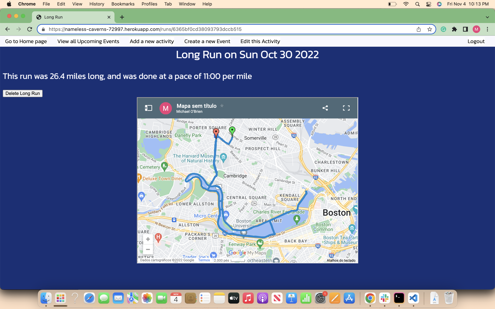

# Old School run tracker
This is a running tracker where you can log your runs and plan for future events. You can opt to provide a link to a map generated on google maps with a gpx file.
## Technologies used
This run tracker app is built using NodeJs, express, jsx and mongoose. 
## Using the app
You can use the following link to use the app: https://nameless-caverns-72997.herokuapp.com/

Create a new user and start logging your activities. You can also create an event you plan to run, so the app always reminds you of how much time you have remaining to prepare. 

## Next steps
Future versions of the app should allow user to upload gpx file.
User should also be able to link each activities to events.

### Trello Board
https://trello.com/invite/b/lC9ZZNjm/ATTI80f4c8256ad31675be0fa403f4b4603a66A93F80/project-2-run-tracker-planner

### ERD
https://lucid.app/lucidchart/fc664c8c-271c-4fb5-9f79-249e9da64fb7/edit?viewport_loc=-11%2C-37%2C1579%2C801%2C0_0&invitationId=inv_6ab0b2da-28d1-422d-9254-55aa1848d53a

